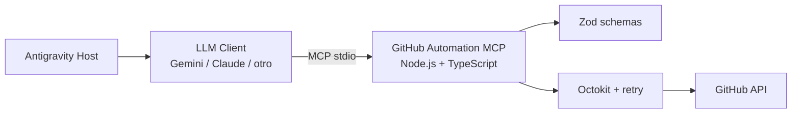

# GitHub Automation MCP

MCP server en Node.js y TypeScript que permite a un agente compatible con MCP (Antigravity, Claude, Gemini u otro host) ejecutar operaciones comunes de GitHub mediante lenguaje natural. La integración usa el SDK oficial de MCP sobre `stdio`, Octokit para la API de GitHub, Zod para validar cada input y Vitest para pruebas.

## Para qué sirve

- Crear repositorios desde una conversación.
- Abrir y consultar issues sin cambiar de contexto.
- Listar repositorios del usuario autenticado.
- Crear o actualizar archivos con un commit.
- Convertir errores técnicos de GitHub en mensajes accionables para el LLM.

## Arquitectura



El servidor nunca escribe logs en stdout: stdout queda reservado para mensajes MCP y los logs de diagnóstico van a stderr. El token se lee desde `GITHUB_TOKEN` y se redacta si aparece en metadata.

## Requisitos

- Node.js 20 o superior.
- npm 10 o superior.
- Una cuenta de GitHub y un Personal Access Token.
- Antigravity u otro host MCP para la demostración interactiva.

## Instalación

```bash
git clone <URL-del-repositorio-publico>
cd github-automation-mcp
npm install
copy .env.example .env
npm run build
```

En macOS/Linux, el equivalente de `copy` es `cp .env.example .env`.

## Token de GitHub

1. Abre GitHub, entra en **Settings > Developer settings > Personal access tokens**.
2. Crea un token fine-grained con acceso al repositorio de demostración.
3. Otorga, como mínimo, permisos de repositorio para **Contents: Read and write** e **Issues: Read and write**. Para crear repositorios del usuario, habilita el permiso de administración de repositorios que GitHub muestre para tu cuenta.
4. Copia el token una sola vez y ponlo en `.env`:

```env
GITHUB_TOKEN=github_pat_...
GITHUB_API_URL=https://api.github.com
LOG_LEVEL=info
RETRY_MAX_ATTEMPTS=3
```

Nunca subas `.env` ni pegues el token en prompts, issues o logs.

## Configurar Antigravity

1. Ejecuta `npm run build`.
2. Asegúrate de que `GITHUB_TOKEN` esté definido en el entorno que abre Antigravity.
3. Usa la configuración incluida en `.vscode/mcp.json`. Su forma equivalente es:

```json
{
  "servers": {
    "github-automation": {
      "type": "stdio",
      "command": "node",
      "args": ["${workspaceFolder}/dist/server.js"],
      "env": { "GITHUB_TOKEN": "${env:GITHUB_TOKEN}" }
    }
  }
}
```

4. Reinicia o vuelve a cargar el host MCP y confirma que aparecen las cinco tools. Si Antigravity requiere un archivo de configuración propio, copia el mismo bloque `servers` respetando su formato MCP.

## Tools

### `create_repository`

Crea un repositorio para el usuario autenticado.

Parámetros: `name: string` (3-100 caracteres, letras, números y guiones), `description?: string`, `isPrivate?: boolean`.

Prompt recomendado: `Crea un repositorio privado llamado inventario-api con la descripción API para inventario.`

### `create_issue`

Abre un issue en un repositorio existente.

Parámetros: `owner: string`, `repo: string`, `title: string`, `body?: string`, `labels?: string[]`.

Prompt recomendado: `En acme/inventario-api crea un issue titulado “Validar SKU duplicado”, describe el bug y agrega la etiqueta bug.`

### `list_repositories`

Lista repositorios del usuario autenticado, ordenados por actualización.

Parámetros: `visibility?: "all" | "public" | "private"`, `perPage?: number` de 1 a 100.

Prompt recomendado: `Lista mis 10 repositorios privados más recientes.`

### `create_commit`

Crea o actualiza un archivo y genera un commit. Si el archivo ya existe, obtiene su SHA antes de actualizarlo.

Parámetros: `owner`, `repo`, `path`, `content`, `message`, `branch?`.

Prompt recomendado: `En acme/inventario-api, crea docs/uso.md con esta documentación y haz commit “docs: add usage guide” en main.`

### `list_issues`

Lista issues de un repositorio.

Parámetros: `owner`, `repo`, `state?: "open" | "closed" | "all"`, `perPage?: number`.

Prompt recomendado: `Lista los issues abiertos de acme/inventario-api y resume sus títulos y números.`

## Validación y errores

Los schemas rechazan nombres inválidos, títulos vacíos, rutas absolutas o con `..`, archivos mayores a 10 MB y paginaciones fuera de rango. Los errores se clasifican como `ValidationError`, `GitHubAPIError`, `AuthenticationError` o `NetworkError`. Las respuestas MCP contienen texto que el LLM puede comunicar directamente; por ejemplo, un 404 se convierte en: “El repositorio solicitado no fue encontrado. Verifica el nombre e intenta de nuevo”.

Los errores 429 y 5xx tienen hasta tres intentos con backoff exponencial; si GitHub entrega `retry-after`, se respeta ese valor.

## Desarrollo y tests

```bash
npm run dev       # servidor en modo desarrollo con tsx
npm run build     # compila a dist/
npm test          # ejecuta 13 tests unitarios
npm run lint      # typecheck sin emitir archivos
```

Los tests cubren inputs válidos e inválidos, operaciones Octokit mockeadas, creación y actualización de archivos, 404, credenciales inválidas y errores de red.

## Troubleshooting

- **No aparece ninguna tool:** ejecuta `npm run build`, revisa la ruta a `dist/server.js` y reinicia Antigravity.
- **AuthenticationError:** confirma `GITHUB_TOKEN`, su expiración y sus permisos; no uses comillas tipográficas.
- **404:** comprueba `owner/repo` y que el token tenga acceso al repositorio.
- **403 o 429:** revisa permisos y límites de API; el retry cubre rate limiting temporal, no permisos insuficientes.
- **No hay respuesta:** no ejecutes el servidor manualmente en una terminal esperando texto; MCP usa `stdio`. Revisa los logs de stderr del host.

## Licencia

MIT. Ver [LICENSE](LICENSE).