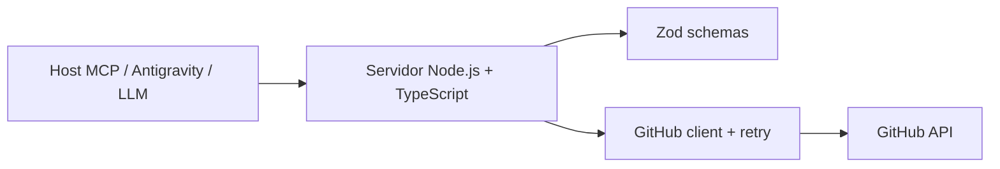

# Pull Request: GitHub Automation MCP

## Título sugerido

GitHub Automation MCP: servidor para operaciones de GitHub vía MCP stdio

## Resumen

Esta rama implementa un servidor MCP en Node.js y TypeScript que permite a un cliente compatible con MCP (como Antigravity, Claude o Gemini) ejecutar operaciones comunes de GitHub mediante lenguaje natural.

El objetivo principal es encapsular llamadas a la API de GitHub a través de herramientas MCP bien definidas, validando entradas con Zod, manejando errores con clasificación explícita y aplicando reintentos para errores transitorios de red o rate limiting.

## Contexto

El proyecto entrega una integración lista para uso por agentes LLM con estas capacidades:

- Crear repositorios del usuario autenticado.
- Abrir y consultar issues.
- Listar repositorios.
- Crear o actualizar archivos con commit.
- Realizar consultas sobre issues y repositorios.

La operación se realiza a través del SDK oficial de MCP usando transporte stdio, con stdout reservado para mensajes MCP y logs de diagnóstico enviados a stderr.

## Cambios principales

### 1. Servidor MCP

Se define un servidor basado en `@modelcontextprotocol/sdk` con herramientas registradas para:

- `create_repository`
- `create_issue`
- `list_repositories`
- `create_commit`
- `list_issues`

La lógica central se concentra en `src/server.ts`, donde cada tool llama a una operación específica y convierte errores en respuestas MCP normalizadas.

### 2. Cliente de GitHub

La integración con GitHub se aloja en `src/github/client.ts` y `src/github/operations.ts`.

Incluye:

- cliente Octokit configurado desde `GITHUB_TOKEN`
- manejo centralizado de errores
- reintentos para 429 y 5xx
- soporte para `retry-after` cuando GitHub lo devuelve

### 3. Validación y esquemas

La capa de validación vive en `src/schemas/index.ts`.

Se validan:

- nombres de repositorio
- títulos y bodies de issues
- rutas de archivo (sin rutas absolutas ni `..`)
- tamaño máximo de contenido (10 MB)
- paginación dentro de rangos permitidos

Esto evita que el servidor reciba entradas inválidas y facilita respuestas funcionales al cliente LLM.

### 4. Manejo de errores

En `src/errors/index.ts` se clasifican los errores de la aplicación en:

- `ValidationError`
- `GitHubAPIError`
- `AuthenticationError`
- `NetworkError`

Esto permite transformar errores técnicos de GitHub en mensajes comprensibles para el agente y para el usuario final.

### 5. Logging y utilidades

Además, se incorpora soporte de logging y utilidades de retry en:

- `src/utils/logging.ts`
- `src/utils/retry.ts`

La implementación asegura que ningún log vaya a stdout, respetando el contrato de MCP.

## Arquitectura de la solución



## Configuración y ejecución

El proyecto requiere:

- Node.js 20+
- npm 10+
- Token de GitHub en variable `GITHUB_TOKEN`

Comandos relevantes:

```bash
npm install
npm run build
npm test
npm run lint
```

También se incluye soporte para ejecutar el servidor en modo desarrollo:

```bash
npm run dev
```

## Pruebas y validación

La rama incluye pruebas unitarias para cubrir:

- inputs válidos e inválidos
- operaciones mockeadas de Octokit
- creación y actualización de archivos
- errores 404
- credenciales inválidas
- fallos de red

La suite se ejecuta con Vitest:

```bash
npm test
```

## Riesgos y consideraciones

- Las operaciones de creación y actualización afectan recursos reales de GitHub.
- El token debe estar correctamente configurado y con permisos mínimos necesarios.
- Se recomienda revisar permisos sobre repositorios y issues antes de usar operaciones de escritura.
- El servidor no debe escribirse en stdout; los logs van a stderr.

## Checklist de revisión

- [x] El servidor usa MCP stdio correctamente.
- [x] Se validan datos de entrada con Zod.
- [x] Los errores se convierten en respuestas útiles para el agente.
- [x] Existe manejo de retries para rate limiting y errores temporales.
- [x] La documentación del proyecto está actualizada.
- [x] Las pruebas cubren las operaciones principales.

## Nota de rama

La rama actual en este entorno es `main`, y no hay cambios no confirmados ni una rama de feature activa separada. Este documento representa la documentación de PR del estado actual del repositorio y de la implementación entregada en esta base de trabajo.
